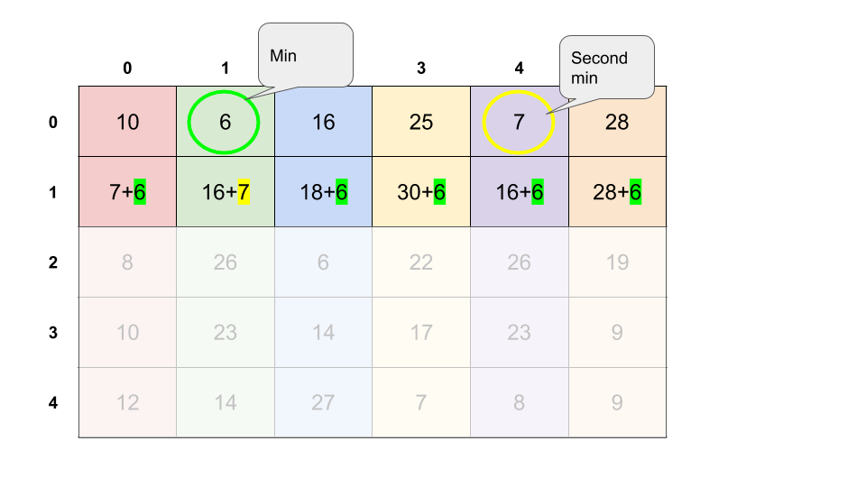

# Notes

It's quite trivial to think of a $O(n \cdot k^2)$ Dynamic Programming solution. However, that's not what we want (although it passes the test cases). If we think about what the bottleneck is, we would figure out that it's actually the way we look through all possible states in the `i-1` layer to transit to the `i` layer.
$$
dp[i][j]\ =\ \min_{0 \le l \lt k, l \neq j}\{dp[i-1][l]\} + costs[i][j]
$$
Then, let's think about the term $\min_{0 \le l \lt k, l \neq j}\{dp[i-1][l]\}$, we can preprocess it right? There is no need to have another inner loop for this. However, the only case it's not feasible is when the minimum term happens to have the same color, which is $l = j$. In that case, we need the second minimum for transition.

In fact, this trick can be generalized to other DP problems that have a similar transition form.