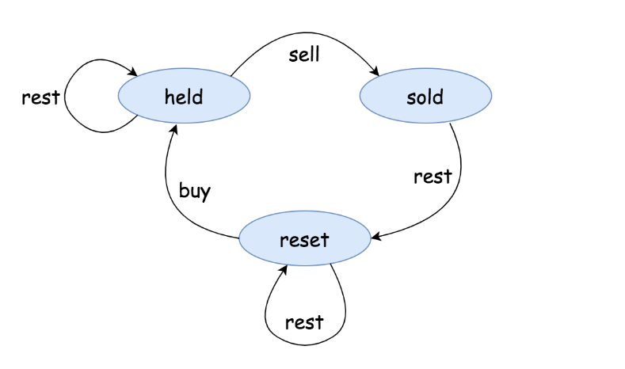

# Notes

Firstly, let's introduce **State Machine**

Let us define a **state machine** to model our agent. The state machine consists of three states, which we define as follows:

- state `held`: in this state, the agent holds a stock that it bought at some point before.
- state `sold`: in this state, the agent has just sold a stock right before entering this state. And the agent holds no stock at hand.
- state `reset`: first of all, one can consider this state as the starting point, where the agent holds no stock and did not sell a stock before. More importantly, it is also the *transient* state before the `held` and `sold`. Due to the **cooldown** rule, after the `sold` state, the agent can not immediately acquire any stock, but is *forced* into the `reset` state. One can consider this state as a "reset" button for the cycles of buy and sell transactions.

At any moment, the agent can only be in **one** state. The agent would transition to another state by performing some **actions**, namely:

- action `sell`: the agent sells a stock at the current moment. After this action, the agent would transition to the `sold` state.
- action `buy`: the agent acquires a stock at the current moment. After this action, the agent would transition to the `held` state.
- action `rest`: this is the action that the agent does no transaction, neither buy or sell. For instance, while holding a stock at the `held` state, the agent might simply do nothing, and at the next moment the agent would remain in the `held` state.

Having this in mind, we can easily write down our recurrence relation as follows:

- $sold[i]=held[i-1]+price[i]$: State `sold` has to be transferred from state `held`.
- $held[i]=\max(held[i-1], reset[i-1]-price[i])$: State `held` on the i-th day can  be either transferred from the state `held` on the (i-1)-th day (means we do nothing) or from the state `reset` on the (i-1)-th day (means after the **cooldown**, we buy the stock).
- $reset[i]=\max(reset[i-1], sold[i-1])$: State `reset` on the i-th day can  be either transferred from the state `reset` on the (i-1)-th day (means we do nothing) or from the state `sold` on the (i-1)-th day (after we sell the stock, we are forced to **cooldown**).

