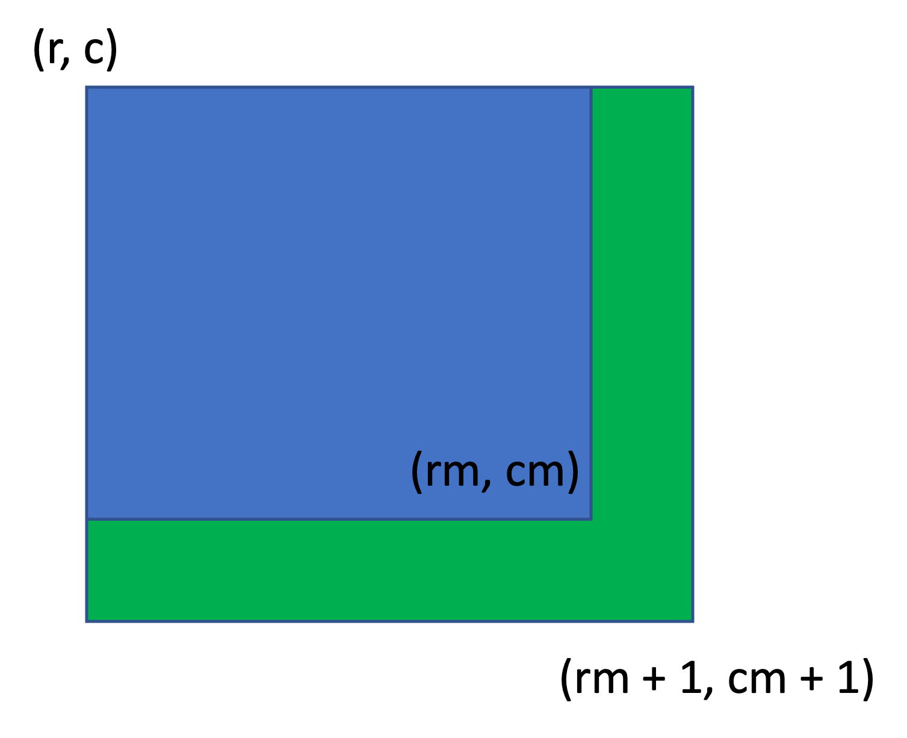

# Notes

This question is truly an interesting and chanllenging one. As simple as the question description is, we are asked to find the maximum sum of a sub-matrix that is not larger than a given value $k$.

### A Failure Attempt

The words in the question can easily remind us of the binary search, as it's perfect for solving problems like "find the max/min value of something that is conditioned to something". However, the dimension is two in this question which means we can't directly apply binary search for the following reason:

Let's say we iterate the coordinate of the top-left corner, say $(r, c)$, then binary search the bottom-right corner. There are two scenarios: the cuurrent sub-matrix sum satisfies the condition or it fails. Take satisfying as an example, the next step is to update the range by setting the left border to be the middle plus one. However, we can see from the image that by doing this, the green area is left over which makes this solution wrong.

### Solution

The correct solution is quite smart. Since we can't do this in two-dimensional space, why not reduce it back to 1D-array? To convert a sub-matrix into a 1D-array, we can sum up each column. An example is given below:
$$
1\ 2\ 3\\ 
\ \ \ \ \ \ \ \ \ \ \ \ \ \ \ \ \ \ \ \ \ \  \ \ \ \ \ \ \ \ \ \ \ \ \rightarrow\ \ \ 5\ 7\ 8
\\
4\ 5\ 6 
$$
Then, we store the prefix sum of this new array into an ordered set, like a TreeSet. Our task is to find a sum that is not larger than $k$ and as large as possible. So we enumerate a prefix sum $S$ first, then we can transfer the task to finding another prefix sum $X$ such that $S - X \le k$ and we take the maximum $X$. In other word, we find the largest $X$ such that $X \ge S - k$. Since the prefix sums are stored in a sorted manner, we can apply binary search to find $X$ now. The final answer should be $\max_{S}\{S - X\}$.

This question provides us with a good direction when dealing with 2D-matrices. Instead of using the 2D prefix sums, we can squeeze any sub-matrix into a 1D-array.