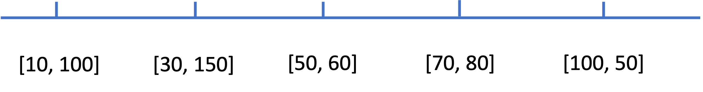

# Notes

We introduce the solution with Heap (Priority Queue) here.

Now, one thing to keep in mind is that, in this question, we only care about the fuel, not the position. The problem we need to solve in this question is that how to determine whether refuel or not at each station. Actually, we don't decide immediately because we don't know how. Instead, we store these stations in a max heap. Then, whenever we run out of gas at some point, we go back to our heap and pick the station with maximum gas to refuel (max heap helps us do this in $O(\log N)$ time) until the gas in our tank is enough for us to reach that point. The answer should be the number of stations we poll from the heap.

Now, why do I say we don't care about the position? Consider the following case:

We can see that we will actually go to the second station first then go to the first station to refuel. That's caused by using the priority queue and we just pick the largest one without considering the position. But we can interpret this behavior in this way: when we reach station 1, we refuel; when we reach station 2, we also refuel.

The key to this question is that we don't know what future is like and we can't make the decision right away. So we store the options and decide when we can decide. 