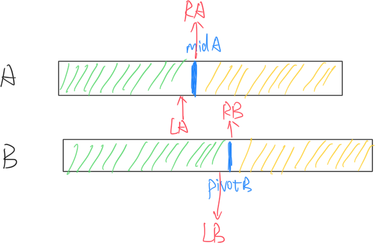

This is a very interesting question. The main Idea here is not to consider the whole array, but to only consider the attribute of median.

Recall that for a median in an array, it divides the array into two equal-length parts. So here, we are doing the same thing. But how do we decide howmany elements should we retrieve from array A and B respectively? Based on the requirement of time complexity of $O(log(n+m))$, it's not hard to think of **binary search**! Wait a second, do we need to do binary search on both arrays? No! Since we know the size of half of the merged array (in this case, $\frac{n+m+1}{2}$), if we know how many elements we should take from array A, then the number of elements we should take from array B is also determined. Therefore, we only need to do binary search on array A.

Now, we all know the most important thing in binary search is the **condition** to decide which pointer we should move. For this question, after we do binary search on A, A and B are divided into 4 parts (binary saerch divides A into 2 parts, the dividing pivot of B is then determined by the middle of A). Let's define $LA$ as the **rightmost** element in the left part of A, $LB$ as the **leftmost** element in right part of A. ($LB$ and $RB$ are same for B) Then, the conditions should be:

- If $LA \le RB$ and $LB \le RA$, then we are done.
- If $LA > RB$, then let $r = mid - 1$
- If $LB > RA$, then let $l = mid + 1$

Now let me explain this condition. Since both arrays are sorted, we know that $LA \le LB$ and $RA \le RB$. Now, median should make sure that **everything on the left is smaller than everything on the right** (like the pivot in quicksort partioning). Thus, as long as the first condition holds, we will have $LA + LB$ and $RA + RB$ with any $x \in LA + LB,\ y\in RA+RB$, $x \le y$ That's exactly what we need for a median. When $LA \gt RB$, it means the value in left part of A is too big. We need to reduce it. So $r=mid-1$. Same for the 3rd condition.

Last but not the least, if $n+m$ is even, then the median should be determined by the average of $\max\{LA,LB\}$ and $\min \{RA,RB\}$. Otherwise, the median is $\max \{LA, LB\}$. 

